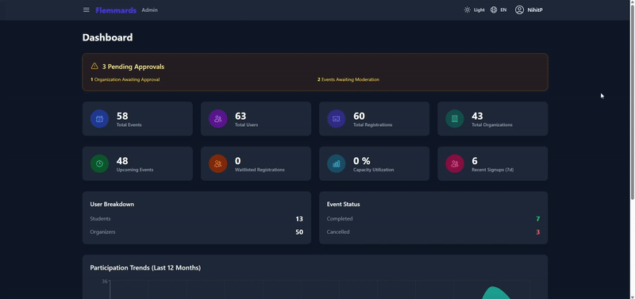
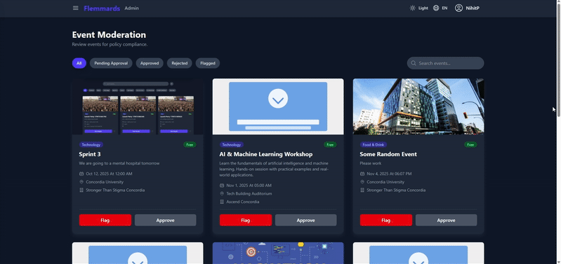
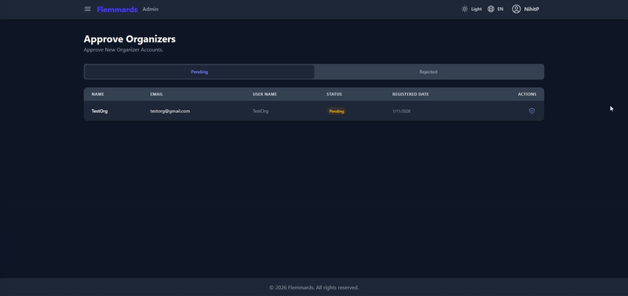
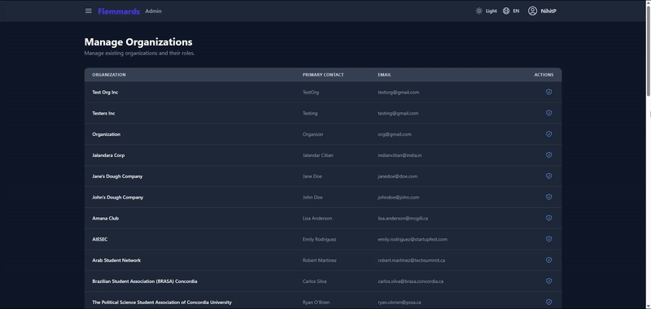

# campus-event-ticketing-platform
*This project was originally developed as a team project for SOEN 341 (Software Process) at Concordia University. Please see credits at the end of this README file.*
*This repository is a **personal showcase copy** of the project.*

## Project Description
This is a web-app for Campus Event & Ticketing Application to help students discover, organize and attend campus events. Additionally, this app allows organizers to create and manage events, and observe the analytics of the events through user-friendly dashboards. Furthermore, this app allows administrators to moderate content and oversee organizations to assure the safety and appropriateness of events.

## Objectives & Core Features

### Objectives
- Centralized platform to discover, browse and attend campus events.
- Enable event organizers to create, promote and obtain feedback on events through user-friendly tools and dashboard.
- Allow administrators to moderate, manage and monitor events and app activity.
- Deliver a user-friendly and secure application that makes attending events simple and more engaging.

### Core Features

#### 1. Student Event Experience
- **Event Discovery:** Browse and search events using filters.
- **Event Management:** Save events to personal calendars, claim and manage tickets efficiently.
- **Student Account:** Create an account to manage personal data and events.

#### 2. Organizer Event Management
- **Event Creation:** Create detailed events that are easily accessible and manageable.
- **Event Analytics:** Provide statistics and feedback to improve future events and to observe potential issues.
- **Tools:** Allow event organizers to make use of collected data.

#### 3. Administrator Dashboard & Moderation
- **Platform Oversight:** Assure the safety of events by only allowing verified organizers and events to be hosted.
- **Analytics:** Accessible dashboard containing simple and efficient way of overseeing all events.
- **Organization Management:** Manage organizations to assure proper control using roles.

## Languages & Frameworks
- **Frontend:** HTML, CSS, JavaScript, Tailwind CSS, ReactJS
- **Backend:** Node.js, Express.js
- **Database:** MongoDB (mongoose)
- **Deployment:** Render
- **Other:** RESTful APIs, JWT Authentication, Session & Cookie Management, Email Services (Nodemailer), Password Hashing (bcrypt), File Upload Handling (Multer), QR Code Generation & Scanning, Calendar Event Integration

## Demo

> **Note:**  
> For demo purposes, the emailing service has been disabled. As a result:
> - No email verification is required upon account creation.  
> - The **Forgot Password** feature is disabled.  
> - Ticket confirmation emails are disabled.  

🔗 **[Access the demo application](https://flemmards-ticketing.onrender.com/login)**

---

### Student

You may create a new account or use the test credentials below:

| Field    | Value             |
|----------|-------------------|
| Email    | Tester@gmail.com  |
| Password | Tester1           |

---

### Organizer

Since new organizer accounts must be manually approved by admins.  
Please use the pre-approved test account:

| Field    | Value              |
|----------|--------------------|
| Email    | Testing@gmail.com  |
| Password | Tester1            |

---

### Admins

Access restricted to authorized administrators only. Admin features demo:

#### Admin Dashboard

---
#### Event Moderation

---
#### Organization Approval

---
#### Organization Moderation


---

## Installation

### Prerequisites
- **Node.js** (version 18 or higher)
- **npm** (comes with Node.js)
- **MongoDB** (local installation or MongoDB Atlas account)

### Steps

1. **Clone the repository:**
   ```bash
   git clone https://github.com/GAROLF05/The_Flemmards-SOEN341_Project_F25.git
   cd The_Flemmards-SOEN341_Project_F25
   ```

2. **Install dependencies:**
   ```bash
   npm install
   npm install --prefix backend
   npm install --prefix frontend
   ```

---

## Setup

1. **Create a `.env` file in the root directory:**
   ```env
   MONGO_URI=mongodb://localhost:27017/The-Flemmards-ConUEvents
   JWT_SECRET=your-super-secret-jwt-key-change-this-in-production
   EMAIL_USER=your-email@gmail.com
   EMAIL_PASS=your-app-specific-password
   ```

2. **Set up MongoDB:**
   - **Local MongoDB:** Start MongoDB service and use `mongodb://localhost:27017/The-Flemmards-ConUEvents`
   - **MongoDB Atlas:** Create a cluster, get connection string, and update `MONGO_URI` in `.env`

3. **Configure email (optional for development):**
   - For Gmail, use an App Password (not regular password)
   - Generate at: https://myaccount.google.com/apppasswords

---

## Usage

### Development Mode

Run both backend and frontend in development mode:

```bash
npm run dev
```

This starts:
- Backend server at `http://localhost:3000`
- Frontend development server at `http://localhost:5173`

### Run Separately

```bash
# Backend only
npm run dev:backend

# Frontend only
npm run dev:frontend
```

### Production Mode

```bash
# Build frontend
npm run build

# Start production server
cd backend
npm start
```

### Running Tests

```bash
# Backend tests
cd backend
npm test

# Frontend tests
cd frontend
npm test
```

## Credits

### Team

| Name               | GitHub Username     | Primary Role |
|--------------------|---------------------|--------------|
| Nameer Hanif       | @GAROLF05           | Backend      |
| Nihit Patel        | @Nihit-patel        | Backend      |
| Elliot Boismartel  | @Elliotbmt          | Backend      |
| Hesham Rabie       | @Hesham-Rabie       | Backend      |
| Curtis Moxebo      | @CurtisMoxebo       | Frontend     |
| Bijoy Sengupta     | @BijoySengupta      | Frontend     |
| Omar Dbaa          | @omardba            | Frontend     |
| Mostafa Maraie     | @MostafaMaraie      | Frontend     |

