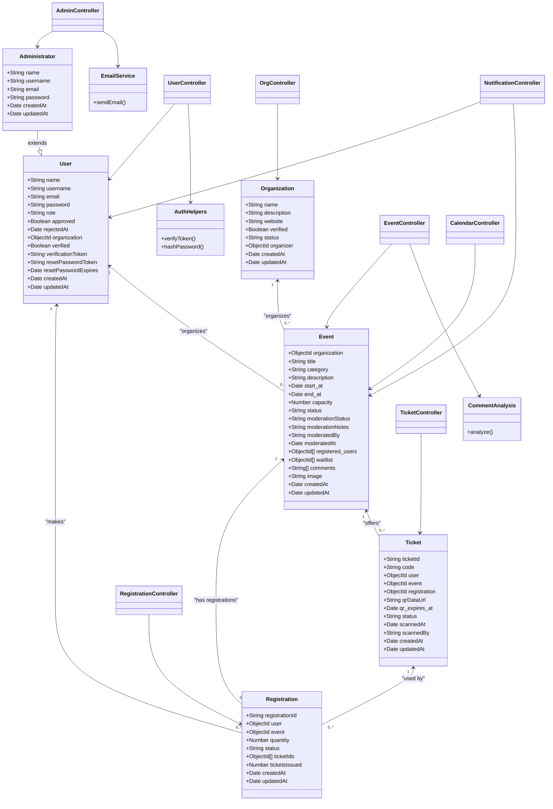

```mermaid
classDiagram

class User {
    +String name
    +String username
    +String email
    +String password
    +String role
    +Boolean approved
    +Date rejectedAt
    +ObjectId organization
    +Boolean verified
    +String verificationToken
    +String resetPasswordToken
    +Date resetPasswordExpires

    +Date createdAt
    +Date updatedAt
}

class Administrator {
    +String name
    +String username
    +String email
    +String password

    +Date createdAt
    +Date updatedAt
}

class Organization {
    +String name
    +String description
    +String website

    +Boolean verified
    +String status
    +ObjectId organizer

    +Date createdAt
    +Date updatedAt
}

class Event {
    +ObjectId organization
    +String title
    +String category
    +String description
    +Date start_at
    +Date end_at
    +Number capacity
    +String status
    +String moderationStatus
    +String moderationNotes
    +String moderatedBy
    +Date moderatedAt

    +ObjectId[] registered_users
    +ObjectId[] waitlist
    +String[] comments
    +String image

    +Date createdAt
    +Date updatedAt
}

class Ticket {
    +String ticketId
    +String code
    +ObjectId user
    +ObjectId event
    +ObjectId registration
    +String qrDataUrl
    +Date qr_expires_at
    +String status
    +Date scannedAt
    +String scannedBy

    +Date createdAt
    +Date updatedAt
}

class Registration {
    +String registrationId
    +ObjectId user
    +ObjectId event
    +Number quantity
    +String status
    +ObjectId[] ticketIds
    +Number ticketsIssued

    +Date createdAt
    +Date updatedAt
}


    class AuthHelpers {
        +verifyToken()
        +hashPassword()
    }
    class EmailService {
        +sendEmail()
    }
    class CommentAnalysis {
        +analyze()
    }

    class UserController
    class AdminController
    class OrgController
    class EventController
    class TicketController
    class RegistrationController
    class CalendarController
    class NotificationController

    Administrator --|> User : extends

    User "1" <-- "0..*" Registration : "makes"
    Event "1" <-- "0..*" Registration : "has registrations"
    Event "1" <-- "0..*" Ticket : "offers"
    Organization "1" <-- "0..*" Event : "organizes"
    User "1" <-- "0..*" Event : "organizes" 
    Ticket "1" <-- "0..*" Registration : "used by"

    UserController --> User
    AdminController --> Administrator
    OrgController --> Organization
    EventController --> Event
    TicketController --> Ticket
    RegistrationController --> Registration
    CalendarController --> Event
    NotificationController --> User
    NotificationController --> Event

    UserController --> AuthHelpers
    AdminController --> EmailService
    EventController --> CommentAnalysis

```
