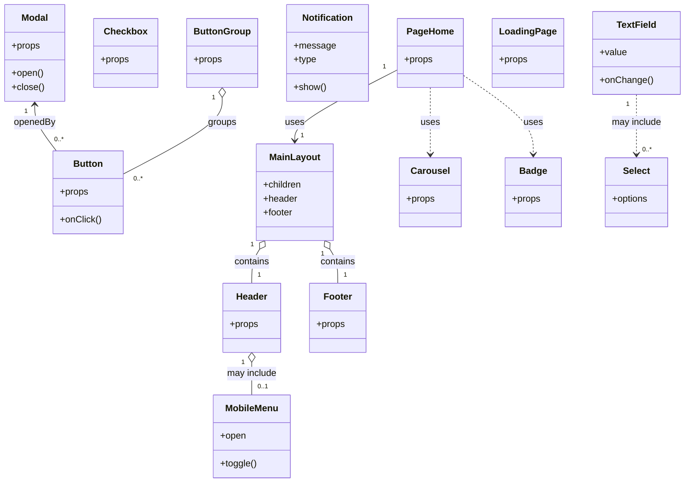

```mermaid

classDiagram
    class Button {
        +props
        +onClick()
    }
    class ButtonGroup {
        +props
    }
    class Badge {
        +props
    }
    class Carousel {
        +props
    }
    class Checkbox {
        +props
    }
    class Modal {
        +props
        +open()
        +close()
    }
    class Notification {
        +message
        +type
        +show()
    }
    class Select {
        +options
    }
    class TextField {
        +value
        +onChange()
    }
    class Header {
        +props
    }
    class Footer {
        +props
    }
    class MobileMenu {
        +open
        +toggle()
    }
    class LoadingPage {
        +props
    }
    class MainLayout {
        +children
        +header
        +footer
    }
    class PageHome {
        +props
    }

    MainLayout "1" o-- "1" Header : contains
    MainLayout "1" o-- "1" Footer : contains
    Header "1" o-- "0..1" MobileMenu : may include
    PageHome "1" --> "1" MainLayout : uses
    PageHome ..> Carousel : uses
    PageHome ..> Badge : uses
    Modal "1" <-- "0..*" Button : openedBy
    ButtonGroup "1" o-- "0..*" Button : groups
    TextField "1" ..> "0..*" Select : may include

```
