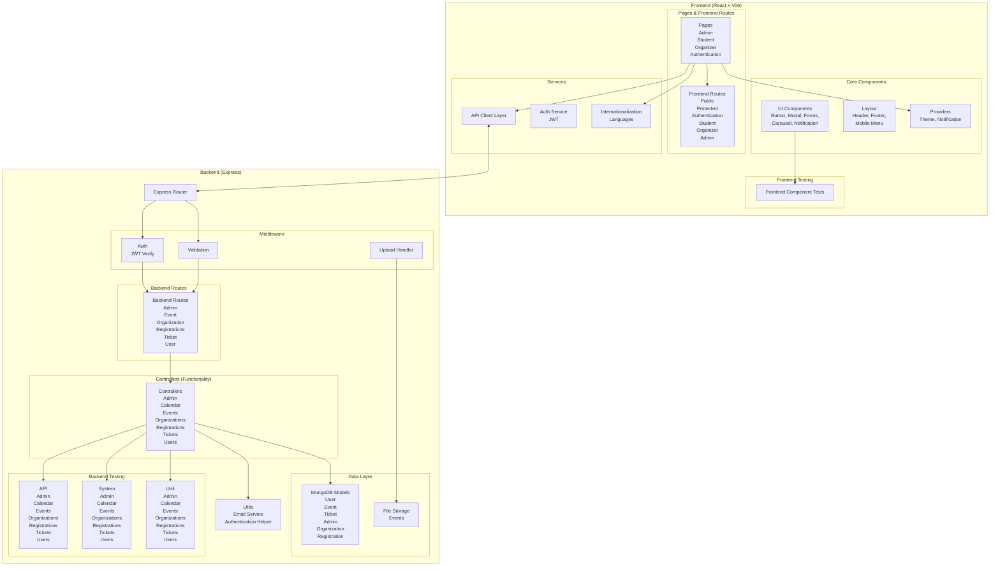

```mermaid
graph TB
    subgraph "Frontend (React + Vite)"
        subgraph "Pages & Frontend Routes"
            Pages[Pages<br/>Admin<br/>Student<br/>Organizer<br/>Authentication]
            FrontendRoutes[Frontend Routes<br/>Public<br/>Protected<br/>Authentication<br/>Student<br/>Organizer<br/>Admin]
            Pages --> FrontendRoutes
        end

        subgraph "Core Components"
            UI[UI Components<br/>Button, Modal, Forms,<br/>Carousel, Notification]
            Layout[Layout<br/>Header, Footer,<br/>Mobile Menu]
            Context[Providers<br/>Theme, Notification]
        end

        subgraph "Services"
            API_Client[API Client Layer]
            Auth[Auth Service<br/>JWT]
            I18N[Internationalization<br/>Languages]
        end

        Pages --> API_Client
        Pages --> Context
        Pages --> I18N

        subgraph "Frontend Testing"
            Tests[Frontend Component Tests<br/>]
        end

        UI --> Tests
        
    end

    subgraph "Backend (Express)"
        Router[Express Router]

        subgraph "Backend Routes"
            BackendRoutes[Backend Routes<br/>Admin<br/>Event<br/>Organization<br/>Registrations<br/>Ticket<br/>User]
    end
    
        subgraph "Middleware"
            Auth_MW[Auth<br/>JWT Verify]
            Valid_MW[Validation]
            Upload_MW[Upload Handler]
        end

        subgraph "Controllers (Functionality)"
            Controllers[Controllers<br/>Admin<br/>Calendar<br/>Events<br/>Organizations<br/>Registrations<br/>Tickets<br/>Users]
        end

        subgraph "Data Layer"
            Models[MongoDB Models<br/>User<br/>Event<br/>Ticket<br/>Admin<br/>Organization<br/>Registration]
            Storage[File Storage<br/>Events]
        end

        Router --> Auth_MW & Valid_MW
        Auth_MW & Valid_MW --> BackendRoutes
        BackendRoutes --> Controllers
        Controllers --> Models & Utils[Utils<br/>Email Service<br/>Authentication Helper]
        Upload_MW --> Storage

        subgraph "Backend Testing"
            API[API<br/>Admin<br/>Calendar<br/>Events<br/>Organizations<br/>Registrations<br/>Tickets<br/>Users]
            System[System<br/>Admin<br/>Calendar<br/>Events<br/>Organizations<br/>Registrations<br/>Tickets<br/>Users]

Unit[Unit<br/>Admin<br/>Calendar<br/>Events<br/>Organizations<br/>Registrations<br/>Tickets<br/>Users]
        end
Controllers --> API

Controllers --> System

Controllers --> Unit
    end

    API_Client <--> Router

```

